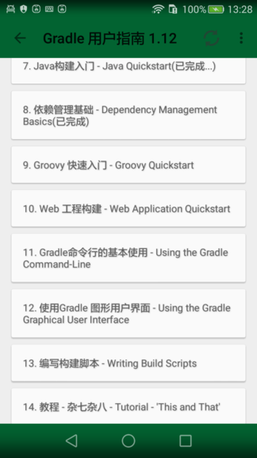
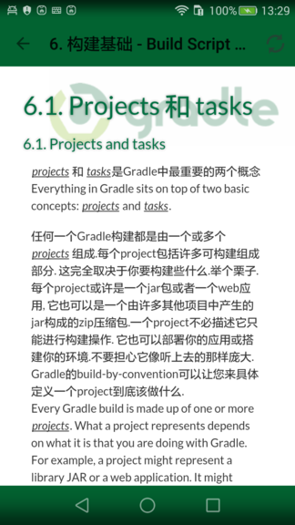
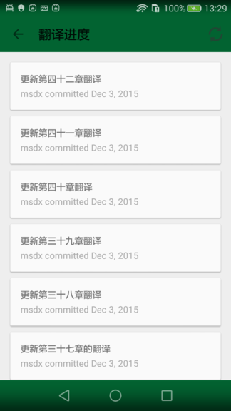
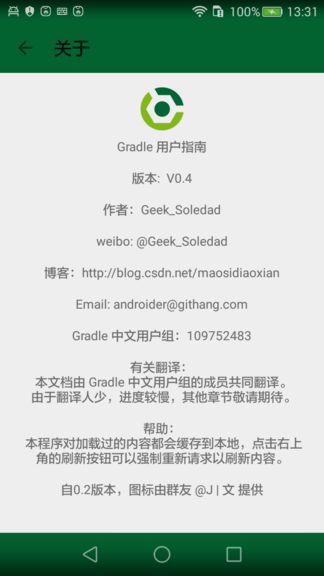

# Gradle用户指南

Gradle UserGuide apk，支持 android 2.2以上。

Gradle用户指南，可以在地铁或路上随时查看Gradle双语文档。

目前中文翻译还在继续，共享此应用只为方便其他开发者。

最新版本下载地址：http://fir.im/gradledoc

由于原签名文件丢失（一脚把笔记本硬盘踹坏了= =！），发布新版时将使用新的签名，如果无法升级，请卸载重装。

应用截图：

